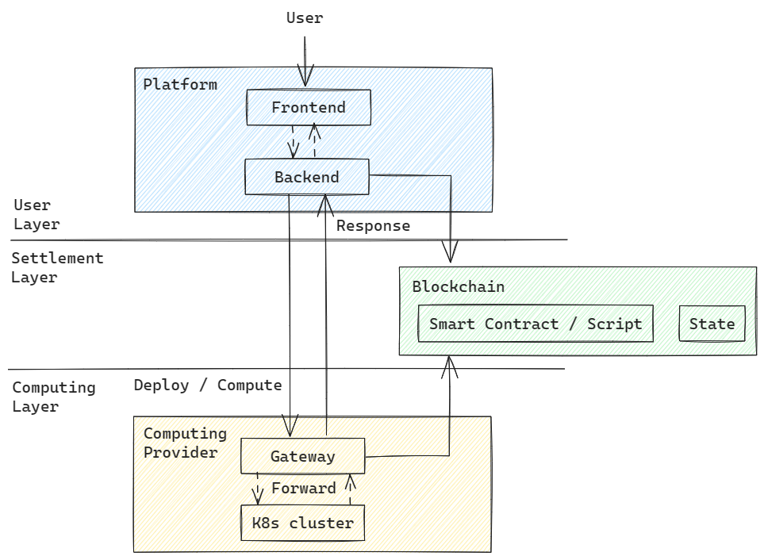
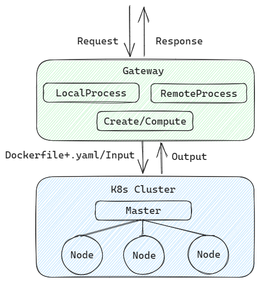
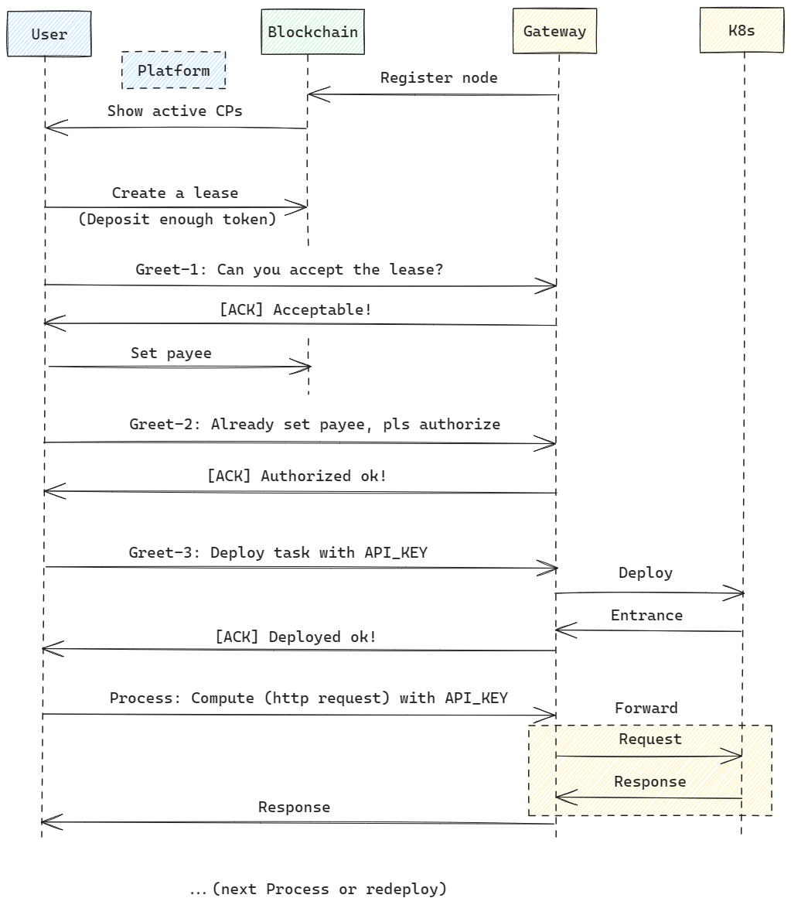

# Computing-API

集群整合算力，节点提供资源服务获取收益。

与传统云平台不同的关键点：用户、计算节点都不可信，结算和验证也不能依赖有信任要求的第三方。

## 系统结构

整体三层：

计算层：

## 工作流

对于用户：

1. 用户通过管理合约或工厂合约等能记录上链的方式，根据自己的需求生成一份订单上链。用钱包签署相关交易。（这一步也可以合并到第4步做）
2. 用户在第三方平台页面上发现可用的计算节点列表，包括这些节点的配置信息和最低单价。
3. 用户选定计算节点后，与节点直接通信协商。节点检查相关订单信息，通过后会返回`ACK`表示可以接受该订单条件。
4. 用户在合约内将该计算节点设置为`payee`，质押足够的报酬，并设置服务开始时间，通知计算节点。计算节点检查合约信息，通过后会为用户授权相应的资源和访问权限，并返回`ACK`告知用户。
5. 用户可根据模板生成计算任务，如使用多少资源、运行或构建什么镜像。计算节点在完成运行后会告知用户。
6. 后续用户提供`input`如模型的`prompt`和各种参数，计算节点返回`output`给用户。

值得注意的是，这里为了避免引入可信第三方做验证，以及保证结算的公平性：

- 用户拥有订单的所有权。如果用户认为计算节点的服务不可靠，随时能够结束订单。
- 订单内质押的报酬随时间释放，保证计算节点的权益。用户结束订单时会自动触发结算，计算节点通过函数也可以手动触发。
- 为了保证用户的权益和体验，合约逻辑内可以加入一段试用期。试用期内用户取消订单不扣费（除了交易手续费）。

在没有能力验证双方可信度的情况下，用释放合约来保证用户和计算节点双方的权益。

对于平台：

1. 监听区块链上，专门用于记录计算节点配置的合约。
2. 在页面上展示这些计算节点，并提供与这些节点交互的方式。

平台可以把上述提到的用户操作整合到平台页面中，方便用户操作。

对于计算节点：

1. 在本地用k8s统合集群计算资源。
2. 在合约内注册自己的信息。
3. 等待用户生成订单并接入。
4. 提供接口供用户远程调用。接口内部会调用k8s起的相应服务。

总的来说，计算节点内部整合算力是通过集群这种中心化的方式，但最后提供的服务是去中心化的形式，不依赖可信第三方，用户可以自由选择提供服务的节点。

## 计算层

前置：通过k8s完成底层资源的整合。前期不考虑复杂任务的情况下，只提供可选的几个镜像或任务列表（可存放在MEFS上），镜像内封装模型和应用、服务。

核心：Computing-Gateway。Gateway只做两件事：用户访问授权与验证、转发用户输入和服务输出。

k8s保证节点如何调用算力资源，gateway保证用户使用服务和节点的收益。

实现三块接口：

- 本地处理。只依赖本地的事务，如算力统计、授权、验证用户权限、启动/停止计算任务。
- 远程处理。与链上相关的事务，如注册、验证合约、结算。
- 计算。负责接收、处理用户的请求，并返回结果。

## 平台

与用户相关。主要为页面、钱包接入。

后端接口：

- 获取计算节点的信息列表并展示。
- 为用户构建相关的交易内容并发起交易。
- 将与计算节点之间的交互抽象出来，方便用户操作。

平台提供的所有功能在理论上都不需要信任，因为都是可以验证的，且任何人都可以做平台方。

## 合约

不一定是合约的形式，主要能解决两个问题即可：

- 注册：计算节点注册相应的资源信息。后续用于提供给用户选择。
- 结算：用户生成订单，完成双方的结算。
