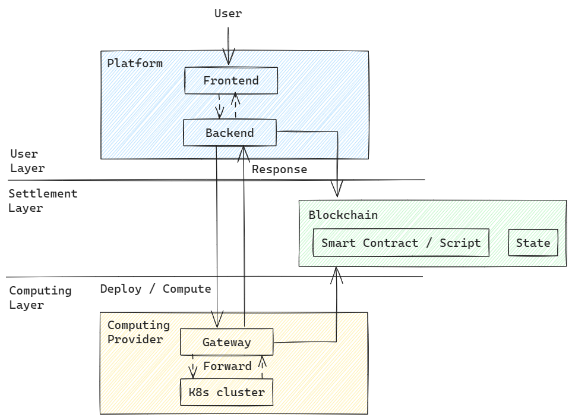
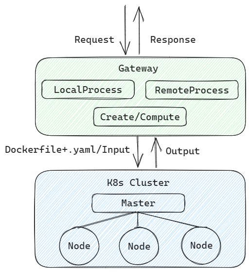
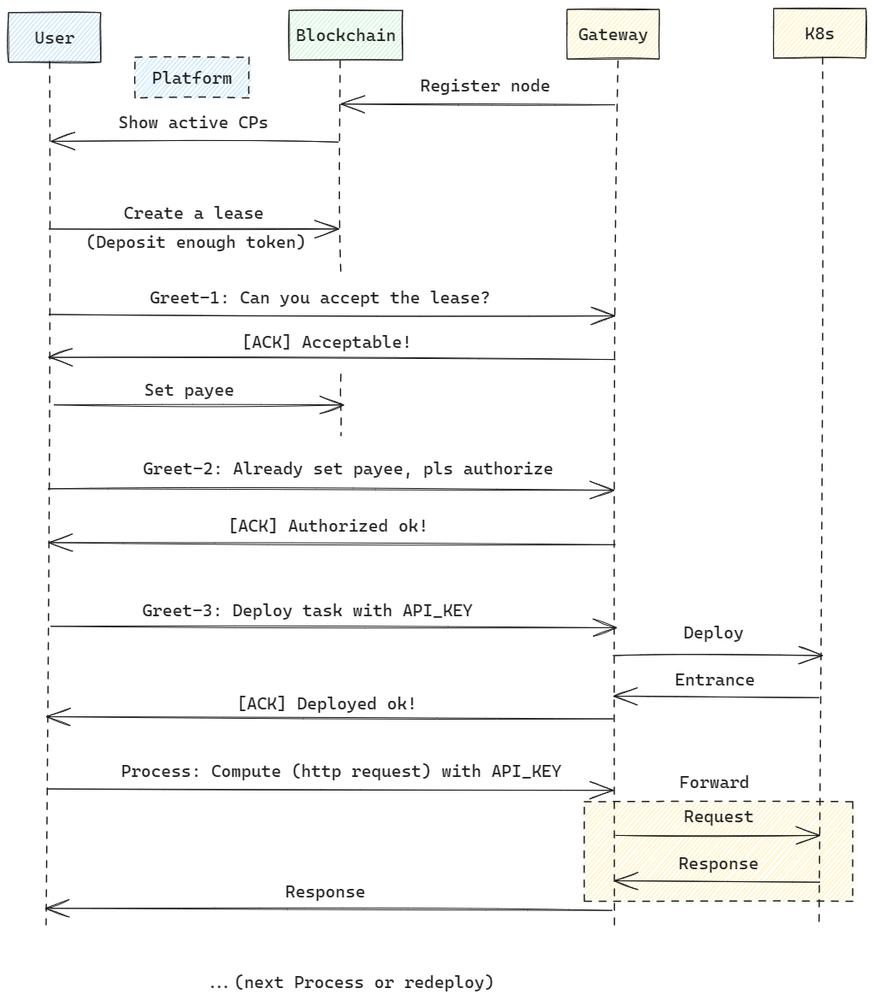
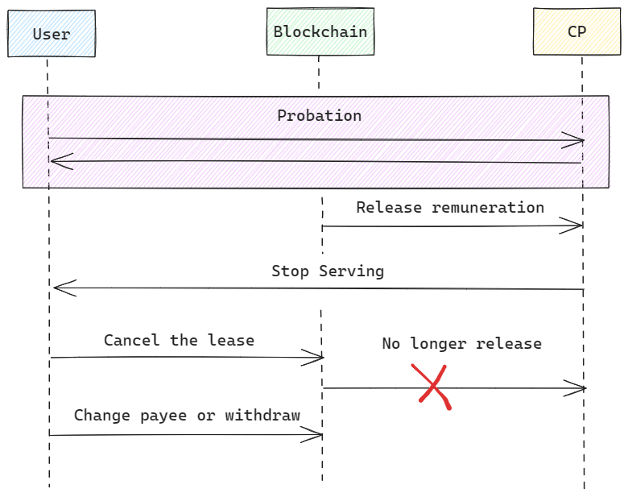

# Computing-API

Clusters integrate computing power, and nodes provide resource services to earn profits.

Key differences from traditional cloud platforms: neither users nor computing nodes are trustworthy, and settlement and verification cannot rely on third parties with trust requirements.

## System Architecture

Three-tier structure

### User Layer

In the user layer, there are actually two types of roles: one is the user, and the other is the platform. The existence of the platform does not introduce centralization but is convenient for user operations, similar to an exchange. Users can switch platforms at any time or even complete operations on their own. For the platform, the front end provides pages for user access and operations, while the back end is responsible for communication with the settlement layer and the computing layer.

- The back end's operations on the settlement layer mainly include: obtaining a list of nodes providing computing services, generating transactions for lease contracts, and related contract management operations.
- The back end's operations on the computing layer mainly include: calling its two external interfaces - `Greet` and `Process`. `Greet` is used to obtain access permissions and deploy computing tasks, while `Process` is for users to access deployed services via `HTTP` requests.

### Settlement Layer

The settlement layer uses blockchain to provide two main functions. (1) Registration of computing layer nodes, including their domain names or IPs, resource status, and prices. Subsequently, the platform can count the list of nodes providing services in the registration contract. (2) Recording and execution of lease contracts at the user layer. This includes the amount of resources rented, rental time, deposits, and the receiving party. Users can cancel leases, and the deposit is released to the receiving party over time.

The computing layer is mainly divided into two parts, one is the gateway, and the other is the computing cluster managed by k8s. The gateway is responsible for external communication, including (1) communication with the settlement layer, such as registering nodes and verifying leases. (2) Communication with the user layer, providing two interfaces for access and operation, and verifying the legality of user permissions. When users access their deployed services, the gateway only forwards requests and responses, and the actual computing is completed in containers running in k8s.

For more detailed information, refer to the structure diagram of the computing layer below.

## Workflow

For users:

1. Users generate an order on the chain according to their needs through management contracts or factory contracts, which can record on the chain. Sign the related transactions with their wallets. (This step can also be merged into step 4)
2. Users discover a list of available computing nodes on the third-party platform page, including the configuration information and minimum unit price of these nodes.
3. After the user selects the computing node, they communicate directly with the node to negotiate. The node checks the relevant order information and, if passed, returns `ACK` to indicate that it can accept the order conditions.
4. The user sets the computing node as `payee` in the contract, pledges enough compensation, and sets the service start time, notifying the computing node. The computing node checks the contract information, and if passed, it will authorize the corresponding resources and access permissions for the user and return `ACK` to inform the user.
5. Users can generate computing tasks according to templates, such as how many resources to use, what images to run or build. The computing node will inform the user after completing the operation.
6. Subsequently, the user provides `input` such as the model's `prompt` and various parameters, and the computing node returns `output` to the user.

It is worth noting that to avoid introducing a trusted third party for verification and to ensure the fairness of the settlement:

- Users own the order. If users believe that the service of the computing node is unreliable, they can end the order at any time.
- The compensation pledged in the order is released over time, ensuring the rights and interests of the computing node. When users end the order, the settlement will be triggered automatically, and the computing node can also trigger it manually through functions.
- To ensure the rights and experience of users, the contract logic can include a probation period. Within the probation period, users can cancel orders without any fees deducted (except for transaction fees).

In the absence of the ability to verify the trustworthiness of both parties, the release contract is used to protect the rights and interests of both users and computing nodes.

For platforms:

1. Listen to the blockchain, specifically the contracts used to record the configuration of computing nodes.
2. Display these computing nodes on the page and provide ways to interact with these nodes.

Platforms can integrate the user operations mentioned above into the platform page, making it convenient for users to operate.

For computing nodes:

1. Integrate cluster computing resources locally with k8s.
2. Register their own information in the contract.
3. Wait for users to generate orders and connect.
4. Provide interfaces for users to call remotely. The interface internally calls the corresponding services started by k8s.

In general, the internal integration of computing power in computing nodes is centralized through clusters, but the services provided in the end are decentralized, not relying on trusted third parties, and users can freely choose the nodes providing services.

## Computing Layer

Prerequisite: Complete the integration of underlying resources through k8s. In the early stage, without considering complex tasks, only provide a few optional mirrors or task lists (which can be stored on MEFS), with models and applications/services encapsulated within the mirrors.

Core: Computing-Gateway. The Gateway only does two things: user access authorization and verification, and forwarding user input and service output.

k8s ensures how nodes call computing resources, and the gateway ensures the use of services by users and the benefits of nodes.

Implement three interfaces:

- Local processing. Depends only on local transactions, such as computing resource statistics, authorization, verification of user permissions, starting/stopping computing tasks.
- Remote processing. Transactions related to the chain, such as registration, contract verification, settlement.
- Computing. Responsible for receiving, processing user requests, and returning results.

## Platform

Related to users. Mainly pages, wallet access.

Backend interfaces:

- Obtain and display the list of computing node information.
- Construct related transaction content for users and initiate transactions.
- Abstract the interaction between users and computing nodes, making it easy for users to operate.

All functions provided by the platform do not require trust in theory because they are verifiable, and anyone can be the platform party.

## Contracts

It does not necessarily have to be in the form of contracts; as long as it can solve two main issues:

- Registration: Computing nodes register corresponding resource information. Subsequently used for users to choose.
- Settlement: Users generate orders and complete the settlement between both parties.
