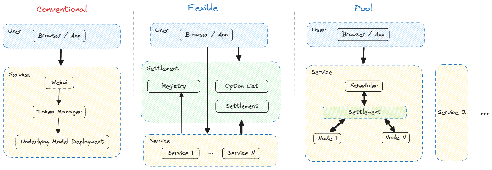

# Computing-API

整合算力节点，提供模型推理服务的各层接口定义和功能。

## 计算层

前置：算力节点下载、运行模型并提供调用时所需的API。对于计算层而言，模型层透明，不关心具体的实现，只关心接口。建议用docker封装，方便扩展与更新。

核心：Computing-Gateway

实现接口包含以下主要功能：

- 接收、处理请求。
- 返回结果。

其他必要的本地功能：

- 验证访问权限。
- 分析算力、计算收益。
- 启动、停止服务。

其他必要的远程功能：

- 节点注册。
- 收益结算。

接口定义参考 `computing/gateway` (golang-ver)。数据通信参考 `model` (protobuf-ver)。

## 中间层

非中心化调度模式（仅有中间平台）：

- 算力节点注册管理、列表展示。

中心化调度模式：

- 对外只展示整合后的服务。
- 内部完成节点的注册与管理。
- 调度框架，包括资源调度、任务分发与处理任务结果。

接口定义参考 `relayer` (golang-ver)。数据通信参考 `model` (protobuf-ver)。

## 应用层

与用户相关。

前端：页面 + 钱包。

后端接口：

- 与中间平台对接，获取服务列表和相关的结算方式。
- 构建交易内容。
- 与处理节点通信、完成验证，通过处理节点提供的API发送输入内容，接收计算后的输出。

接口定义参考 `user/backend` (golang-ver)。数据通信参考 `model` (protobuf-ver)。
